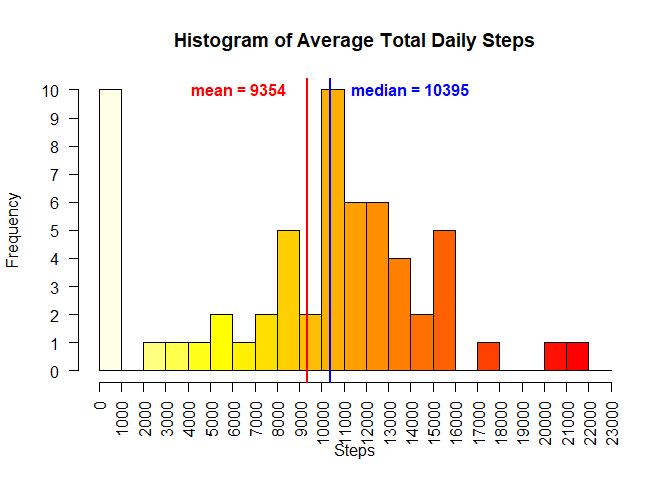
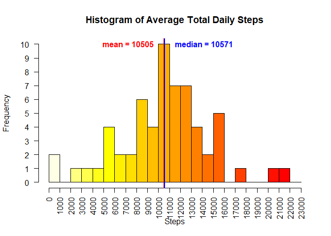
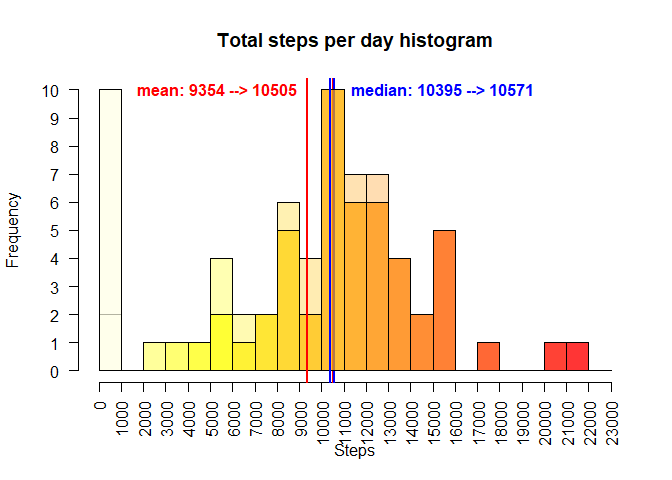
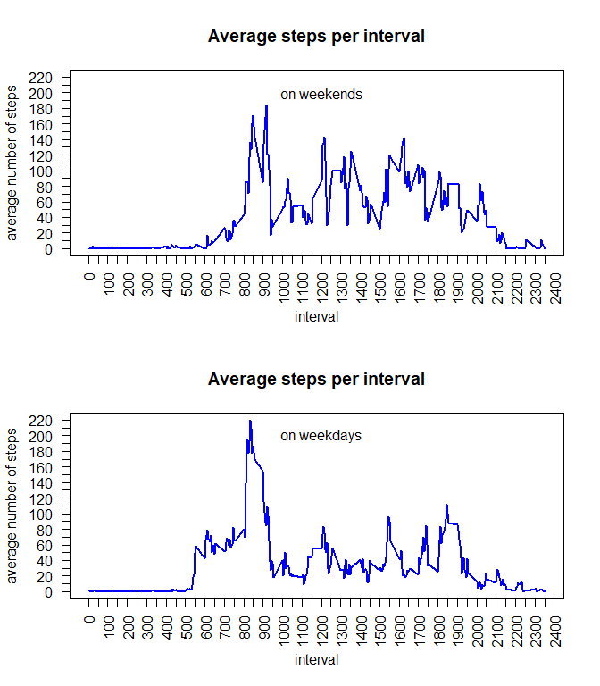

<font size = 3>

## Loading and preprocessing the data
I will read the data using *read.csv()* function and convert class of the *data* variable from *character* to *Date*.

```r
activity <- read.csv("activity.csv")
activity <- transform(activity, date = as.Date(date))
```
## What is mean total number of steps taken per day?
I will create a function that builds a histogram so that I can use it again later.

```r
library(dplyr)

histogram <- function(activity) {
    totals <- group_by(activity, date) %>% summarize(sum = sum(steps, na.rm = TRUE)) %>% 
                select(2) %>% unlist
    
    # Changing total step increment to 1000 from the default of 5000
    hist(totals, breaks = seq(0, 23000, 1000), col = heat.colors(22, rev = TRUE), xaxt = "n", yaxt = "n", 
         xlab = "Steps", main = "Histogram of Average Total Daily Steps")
    axis(side=1, at=seq(0, 23000, 1000), las = 2) 
    axis(side = 2, at = 0:10, las = 2)
    
    # draw and label the mean line
    mean <- mean(totals)
    abline(v = mean, col = "red", lwd = 2)
    text(mean-500, 10, paste("mean =", round(mean)), col = "red", font = 2, pos = 2)
    
    # draw and label the median line
    median <- median(totals)
    abline(v = median, lwd = 2, col = "blue")
    text(median + 500, 10, paste("median =", median), font = 2, pos = 4, col = "blue")
}
```

And now I will actually build a histogram:

```r
histogram(activity)
```

<!-- -->

## What is the average daily activity pattern?
Again, I will create a plot-building function to use not only now but later as well.

```r
intervals <- group_by(activity, interval) %>% summarize(mean = mean(steps, na.rm = TRUE))
myplot <- function(data) {
with(data, plot(mean~interval, type = "l", xaxt = "n", yaxt = "n", ylab = "average number of steps", main = "Average steps per interval", col = "blue", lwd = 2, ylim = c(0,220)))
axis(side = 1, at = seq(0, 2400, 50), las = 3)
axis(side = 2, at = seq(0, 220, 10), las = 2)
}
```

It's time to build an actual plot!

```r
myplot(intervals)
maxinterval <- filter(intervals, mean == max(mean))[1]
abline(v = maxinterval, col = "orange", lwd = 2)
text(maxinterval, 15, maxinterval, col = "red", srt = 90, pos = 2)
```

<!-- -->

It shows that, on average, the busiest 5-minute interval is between 8:35 and 8:40 am.

## Imputing missing values
Let's see in which columns we have NAs:

```r
sapply(activity, function(x) any(is.na(x)))
```

```
##    steps     date interval 
##     TRUE    FALSE    FALSE
```

*steps* only. How many?

```r
countNA <- sum(is.na(activity$steps))
print(countNA)
```

```
## [1] 2304
```

I think it's a good idea to fill those NA spots with imputed values.
For each NA, I'll look into values that correspond to the same 5-min interval as the NA and are 1 or 2 days apart from the NA day.
I will replace my NA with the mean of those 4 values.

I will arrange my data frame by *interval* and *day* to simplify the process of finding those close values. And before that, I will add an *id* variable to track my rows.

```r
arranged <- mutate(activity, id = rownames(activity)) %>% arrange(interval, date)
activityNew <- activity # this will be my new dataset without NAs
```

Which rows contain NA in the *steps* column? I'll find them and, for each, I'll run my algorithm, not forgetting to take care of the margin values.

```r
stepsNA <- which(is.na(activity$steps))
for (i in stepsNA) {
    row = which(arranged$id == i)
    if (row > 2 && row < dim(arranged)[1] - 1) {
        data <- arranged[(row - 2) : (row + 2), 1]
    } else if (row <= 2) {
        data <- arranged[(row + 1) : (row + 4), 1]
    } else {
        data <- arranged[(row - 1) : (row - 4), 1]
    }
    activityNew[i, 1] <- mean(data, na.rm = TRUE)
}
```

We had 2304 NAs. Let's check how many we have now:

```r
sum(is.na(activityNew$steps))
```

```
## [1] 0
```
Good job!

Now lets see our new histogram of average daily steps, without the NAs:

```r
histogram(activityNew)
```

<!-- -->

Doesn't look much different, right? It's easy to notice though that the mean and median are very close now, almost one ine.
To see what's changed a little better, let's overlay the two histograms.

```r
totals <- group_by(activityNew, date) %>% summarize(sum = sum(steps, na.rm = TRUE)) %>% select(2) %>% unlist
hist(totals, breaks = seq(0, 23000, 1000), col = heat.colors(22, rev = TRUE, alpha = 0.3), xaxt = "n", yaxt = "n", xlab = "Steps", main = "Total steps per day histogram")
axis(side=1, at=seq(0, 23000, 1000), las = 2)
axis(side = 2, at = 0:10, las = 2)
mean <- mean(totals)
abline(v = mean, col = "red", lwd = 2)
meanNew <- mean
median <- median(totals)
abline(v = median, lwd = 2, col = "blue")
medianNew <- median
    
totals <- group_by(activity, date) %>% summarize(sum = sum(steps, na.rm = TRUE)) %>% select(2) %>% unlist
hist(totals, breaks = seq(0, 23000, 1000), col = heat.colors(22, rev = TRUE, alpha = 0.7), xaxt = "n", yaxt = "n", add = TRUE)
mean <- mean(totals)
abline(v = mean, col = "red", lwd = 2)
text(mean, 10, paste("mean:", round(mean), "-->", round(meanNew)), col = "red", font = 2, pos = 2)
median <- median(totals)
abline(v = median, lwd = 2, col = "blue")
text(median + 500, 10, paste("median:", median, "-->", medianNew), font = 2, pos = 4, col = "blue")
```

<!-- -->

The histogram shows that the number of days where total steps are in the first thousand dropped significantly compared to the NA-containing dataset. And, of course, a few other numbers went up - shown by the transparent areas of the bars.  
The median shift is not very impressive, but the mean changed by over a thousand steps per day.

## Are there differences in activity patterns between weekdays and weekends?
Let's find out which days are which and create factors, and then group the data by the intervals and weekend category.

```r
weekend <-  ifelse(weekdays(activityNew$date) %in% c("Saturday", "Sunday"), "weekend", "weekday")
activityNew <- transform(activityNew, weekend = factor(weekend))
intervalsNew <- group_by(activityNew, interval, weekend) %>% summarize(mean = mean(steps, na.rm = TRUE))
```
Now I'm plotting the activity by 5-min intervals separately for weekends and weekdays.

```r
par(mfrow = c(2,1))
myplot(subset(intervalsNew, weekend == "weekend"))
text(1200, 200, "on weekends")
myplot(subset(intervalsNew, weekend == "weekday"))
text(1200, 200, "on weekdays")
```

<!-- -->

I see that on weekdays, there is more activity in the early morning and less in the middle of the day compared to weekends.
Thank you for looking! Good luck with your own projects!</font>
